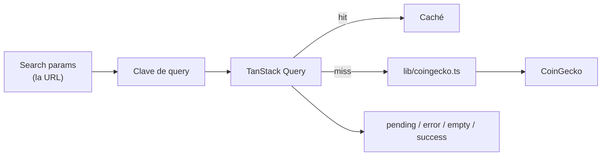
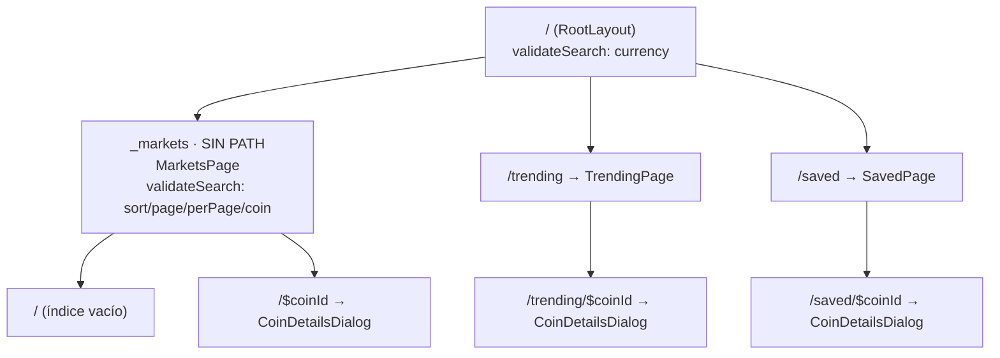

# ARCHITECTURE.md — Cryptosh1f

> Documento vivo. Describe la arquitectura **tal y como está implementada**, no la deseada.
>
> Restricción que domina todas las decisiones: **el límite de tasa de CoinGecko**
> (~10–30 req/min sin API key). Ver `PRODUCT.md` → R1.

---

## Capas

```
┌─────────────────────────────────────────────────────────────┐
│ app/         Composición: árbol de rutas, providers, search params
├─────────────────────────────────────────────────────────────┤
│ features/    markets · trending · saved · coin-details
│              cada una: componentes + hooks propios
├─────────────────────────────────────────────────────────────┤
│ components/  UI compartida y sin estado
├─────────────────────────────────────────────────────────────┤
│ lib/         coingecko.ts (cliente único) · format · queryClient · watchlist
├─────────────────────────────────────────────────────────────┤
│ types/       Contratos de la API validados con Zod
└─────────────────────────────────────────────────────────────┘
```

| Capa               | Por qué existe                                                                                                                                                    |
| ------------------ | ----------------------------------------------------------------------------------------------------------------------------------------------------------------- |
| `app/`             | Separa _qué se compone_ de _qué hace cada cosa_. Añadir un provider o una ruta no toca ningún componente de pantalla.                                             |
| `features/`        | Agrupa por dominio, no por tipo de archivo. Un cambio en "guardados" toca una sola carpeta.                                                                       |
| `components/`      | Solo lo que usan dos o más features. Es donde vive `CoinTable`, compartida por mercado y guardados.                                                               |
| `lib/coingecko.ts` | El único sitio donde existen la URL base, el timeout, la cancelación y la normalización de errores. Antes esas decisiones estaban tomadas siete veces, o ninguna. |
| `types/`           | La respuesta de CoinGecko deja de ser opaca: `market_data.current_price[currency]` se verifica en compilación.                                                    |

## Quién es dueño de cada estado

Esta es la tabla que hay que mirar antes de añadir estado nuevo. Cada categoría tiene un
dueño y solo uno.

| Categoría                           | Dueño                                | Ejemplos                                                                                     |
| ----------------------------------- | ------------------------------------ | -------------------------------------------------------------------------------------------- |
| **Estado de servidor**              | TanStack Query                       | listas de mercado, detalle de moneda, tendencias, series del gráfico                         |
| **Estado compartible / marcable**   | La URL, vía search params del router | divisa, orden, página, tamaño de página, filtro del buscador                                 |
| **Qué está abierto**                | La URL, vía parámetro de ruta        | la moneda del diálogo de detalle (`/{coinId}`)                                               |
| **Estado de cliente persistido**    | `WatchlistProvider` + `localStorage` | la lista de guardados                                                                        |
| **Estado efímero de un componente** | `useState` local                     | texto del buscador antes del debounce, borradores de formulario, métrica y rango del gráfico |

Hubo un `MarketsProvider` que era dueño de la cuarta fila; se eliminó cuando los filtros
pasaron a la URL. Su reemplazo, `features/markets/useMarketsFilters.ts`, mantiene la misma
interfaz pero respaldada por `useSearch` + `useNavigate`.

### Estado de servidor



| Problema                             | Cómo se resuelve                                                                      |
| ------------------------------------ | ------------------------------------------------------------------------------------- |
| Un 429 quedaba como spinner infinito | `status: 'error'` es un estado real y distinto de `pending`                           |
| Sin caché se agotaba la cuota        | Caché por clave: volver a una pestaña no repite la petición                           |
| Carrera entre respuestas             | Query descarta las obsoletas por clave                                                |
| Sin cancelación                      | `AbortController` inyectado en cada `queryFn`, unido al timeout con `AbortSignal.any` |
| Sin reintento                        | Backoff exponencial, y **nunca** en 429 ni en ningún 4xx                              |

**Los datos NO se piden en route loaders**, a propósito. Un loader es una promesa: no sabe
distinguir "CoinGecko nos está limitando" de "esta lista está vacía", y esa distinción
—modelada en `components/QueryState.tsx`— es justo la que arregló el spinner eterno.

### Estado en la URL

| Param      | Dónde se declara  | Rango                                        |
| ---------- | ----------------- | -------------------------------------------- |
| `currency` | ruta raíz         | tres letras; cualquier otra cosa cae a `usd` |
| `sort`     | layout `_markets` | los seis valores de `SORT_OPTIONS`           |
| `page`     | layout `_markets` | entero ≥ 1                                   |
| `perPage`  | layout `_markets` | entero entre 1 y 250                         |
| `coin`     | layout `_markets` | id de moneda; filtra la lista (`ids=`)       |

La divisa vive en la raíz porque la necesitan las tres vistas y el diálogo, que cuelga de
tres padres distintos. El resto vive en `_markets`: en la raíz, `/trending?page=3` sería
una URL válida y sin significado.

Dos middlewares hacen que esto sea usable:

- `retainSearchParams(["currency"])` — **imprescindible**. TanStack Router descarta los
  search params al cambiar de ruta (al revés que react-router). Sin esto, cada enlace del
  menú resetearía la divisa en silencio.
- `stripSearchParams(defaults)` — quita de la URL los valores por defecto, así que `/` sigue
  siendo `/` y las direcciones que ya circulaban siguen funcionando.

Los esquemas Zod usan `.catch()` en **todos** los campos. No es defensivo por gusto: al
mudar los filtros a la URL dejaron de venir de un formulario validado y pasaron a ser
entrada arbitraria en el primer pintado. Si `validateSearch` lanzara con `?currency=eur1`
saldría la frontera de error del router en lugar de la aplicación.

## Grafo de rutas



**`_markets` es una ruta layout sin path** y es la pieza que sostiene el patrón "modal
encima de la lista". Antes `MarketsPage` aparecía dos veces en el árbol —una para `/` y otra
para `/:coinId`— y esa duplicación costó un fallo real: un hijo `:coinId` bajo un padre
`:coinId` produce `/:coinId/:coinId`, que no empareja nunca. Con el layout sin path,
`MarketsPage` se declara una sola vez y queda montada en ambas rutas, así que abrir el
detalle no la desmonta ni vuelve a pedir el mercado. La prueba de humo lo asserta contando
peticiones, no confiando en que siga siendo verdad.

El diálogo recibe `closeTo` como prop porque cuelga de tres padres y TanStack Router no
tiene equivalente de `navigate("..", { relative: "path" })`; `history.back()` sería
incorrecto, porque en un enlace directo se saldría de la aplicación.

**Límite conocido de `notFound`:** una URL de un solo segmento como `/asdf` empareja con
`/$coinId` y acaba mostrando "That coin could not be found" del diálogo sobre la tabla de
mercado. `NotFound` solo cubre rutas de dos o más segmentos. Es el comportamiento que ya
tenía la aplicación y se conserva para no cambiar el espacio de URLs.

## Carga diferida

| Se carga de entrada                      | Se carga bajo demanda                                |
| ---------------------------------------- | ---------------------------------------------------- |
| `RootLayout`, `_markets` → `MarketsPage` | `TrendingPage`, `SavedPage`                          |
|                                          | `CoinDetailsDialog` (las tres rutas comparten chunk) |
|                                          | `PriceChart` → **Recharts**, ~352 kB                 |

Dos niveles, no micro-chunking. `_markets` no se difiere porque es el primer pintado.
`PriceChart` lleva un `React.lazy` propio dentro del modal: sin ese segundo nivel, Recharts
saldría del chunk inicial pero caería entero en el del diálogo, y abrir una moneda
descargaría 352 kB antes de mostrar nada.

## Jerarquía de providers

```
ErrorBoundary                 ← captura fallos de render de todo lo de abajo
  └─ QueryClientProvider      ← estado de servidor: caché, reintentos, cancelación
       └─ WatchlistProvider   ← guardados, espejo de localStorage
            └─ RouterProvider ← estado de la URL: rutas y search params
```

Solo queda un provider de dominio. La dependencia que antes obligaba a anidar
`MarketsProvider` por fuera de `WatchlistProvider` —la vista de guardados necesitaba la
divisa de la de mercado— desapareció al mudar la divisa a la URL: ahora las dos la leen del
router.

## Boundaries

| Boundary         | Implementación                                                                   |
| ---------------- | -------------------------------------------------------------------------------- |
| Error de render  | `ErrorBoundary` en la raíz y por feature: un fallo del gráfico no tumba la tabla |
| Error de red     | Estado de error por query, con acción de **reintentar** visible                  |
| Carga            | `QueryState` con etiqueta descriptiva; `Suspense` para el gráfico                |
| Vacío            | Estado propio, distinto de carga y de error                                      |
| Ruta inexistente | `NotFound`, con el límite descrito arriba                                        |

## Propiedad de carpetas

| Carpeta       | Regla                                                                        |
| ------------- | ---------------------------------------------------------------------------- |
| `app/`        | Solo composición. Sin lógica de dominio                                      |
| `features/*/` | Puede importar de `components/`, `lib/`, `types/`. **Nunca de otra feature** |
| `components/` | Sin estado de servidor, sin imports de features                              |
| `lib/`        | Sin React. Testeable en aislamiento                                          |
| `types/`      | Solo tipos y esquemas Zod                                                    |

La regla "nunca de otra feature" es la que evita que la estructura degenere: si dos features
necesitan lo mismo, ese algo sube a `components/` o `lib/`. `app/paths.ts` existe justamente
por esta regla: `CoinTable` necesita tipar su destino contra las rutas de detalle, y sin ese
módulo intermedio el import cerraría el ciclo `routes.tsx → MarketsPage → CoinTable`.

## Verificación

| Comando             | Qué comprueba                                                                                                                   |
| ------------------- | ------------------------------------------------------------------------------------------------------------------------------- |
| `pnpm typecheck`    | TypeScript strict sobre `src/`, `scripts/` y `vite.config.ts`                                                                   |
| `pnpm lint`         | oxlint: corrección, accesibilidad, hooks, imports, ciclos                                                                       |
| `pnpm format:check` | oxfmt                                                                                                                           |
| `pnpm contrast`     | Cada par de color declarado contra su umbral WCAG 2.2                                                                           |
| `pnpm smoke`        | 45 comprobaciones end-to-end en Chromium, con CoinGecko interceptado, axe incluido, más una aserción sobre el tamaño del bundle |
| `pnpm validate`     | Todo lo anterior más el build de producción                                                                                     |
| `pnpm icons`        | Regenera los PNG de marca desde `public/favicon.svg`                                                                            |
