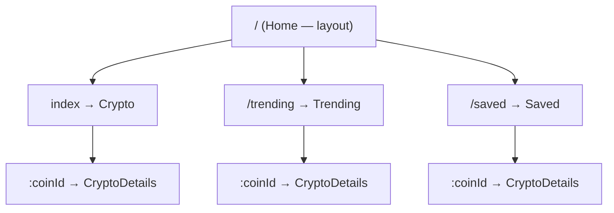
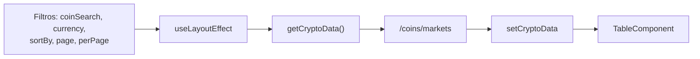
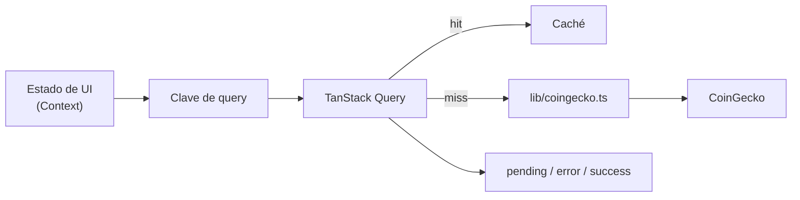

# ARCHITECTURE.md — Cryptosh1f

> Documento vivo. Describe el **estado actual** (pre-refactor) y el **estado objetivo** de la
> Fase 6. Cuando la Fase 6 se complete, la sección "Estado actual" se elimina.
>
> Restricción que domina todas las decisiones de esta arquitectura: **el límite de tasa de
> CoinGecko** (~10–30 req/min sin API key). Ver `PRODUCT.md` → R1.

---

# Parte I — Estado actual

## Capas

```
┌─────────────────────────────────────────────────┐
│ main.jsx        Árbol de rutas (createBrowserRouter)
├─────────────────────────────────────────────────┤
│ pages/          Home = layout + providers
│                 Crypto · Trending · Saved = vistas
├─────────────────────────────────────────────────┤
│ context/        Estado + fetching (acoplados)
├─────────────────────────────────────────────────┤
│ components/     Presentación (con fetch propio en Chart)
└─────────────────────────────────────────────────┘
                         ↓ fetch directo
              api.coingecko.com/api/v3
```

**Problema estructural:** no hay capa de datos. El fetching vive dentro de los providers de
contexto y, en un caso (`Chart.jsx`), dentro de un componente de presentación. Los 7 endpoints
están escritos a mano en 5 archivos sin constante de base URL.

## Grafo de rutas



`CryptoDetails` aparece **tres veces** en el árbol. No es duplicación accidental: es lo que
permite que el modal se abra sobre cualquiera de las tres listas conservando la lista de fondo.
El coste es que añadir una cuarta vista de lista obliga a repetir la ruta hija otra vez.

## Jerarquía de contextos

```
CryptoProvider          ← estado de mercado, divisa, orden, página
  └─ TrendingProvider   ← tendencias (independiente)
       └─ StorageProvider  ← guardados; CONSUME CryptoContext
            └─ <Outlet/>
```

**El orden es obligatorio.** `StorageContext` lee `currency` y `sortBy` de `CryptoContext`
(`StorageContext.jsx:19`) para construir su propia petición. Invertir el anidamiento rompe la app
en tiempo de ejecución sin error de compilación.

## Flujo de datos



El `useLayoutEffect` de `CryptoContext.jsx:76-79` es el **único disparador** de la tabla de
mercado: cualquier control nuevo solo tiene que escribir su estado ahí.

## Flujo de storage

`localStorage["coins"]` guarda un array de ids. `StorageProvider` lo lee al montar, lo refleja en
`allCoins`, y un efecto sobre `allCoins` repide `/coins/markets` para hidratar `savedData`.
El `localStorage` es la fuente de verdad; el estado de React es una proyección.

## Boundaries — no existen

| Boundary | Estado |
|---|---|
| Error de render | **Ninguno.** Una excepción deja pantalla en blanco |
| Error de red | **Ninguno.** El fallo se traga en un `catch` con `console.error` |
| Carga | Convención implícita: `data === undefined` significa "cargando" |

**La consecuencia crítica:** como los `catch` no escriben estado, *cargando* y *error* son el
mismo `undefined`. Un 429 de CoinGecko se renderiza como un spinner permanente.

---

# Parte II — Estado objetivo (Fase 6)

## Capas

```
┌─────────────────────────────────────────────────┐
│ app/         Composición: router, providers, boundaries
├─────────────────────────────────────────────────┤
│ features/    markets · trending · saved · coin-details
│              cada una: componentes + hooks propios
├─────────────────────────────────────────────────┤
│ components/  UI compartida y sin estado
├─────────────────────────────────────────────────┤
│ lib/         coingecko.ts (cliente único) · query · storage
├─────────────────────────────────────────────────┤
│ types/       Contratos de la API validados con Zod
└─────────────────────────────────────────────────┘
```

### Por qué existe cada capa

- **`app/`** — separa *qué se compone* de *qué hace cada cosa*. Hoy `main.jsx` mezcla rutas y
  `Home.jsx` mezcla layout con providers; al separarlo, añadir un provider deja de tocar el layout.
- **`features/`** — agrupa por dominio y no por tipo de archivo. Hoy entender "guardados" obliga a
  abrir `pages/Saved.jsx`, `context/StorageContext.jsx` y `components/TableComponent.jsx`.
  Feature-first hace que un cambio de dominio toque una sola carpeta.
- **`components/`** — solo lo que se usa en más de una feature. `SaveBtn`, hoy duplicado literalmente
  en dos archivos, vive aquí una vez.
- **`lib/coingecko.ts`** — un único punto donde existen la base URL, el timeout, la cancelación, el
  reintento y la normalización de errores. Hoy esas cinco decisiones están tomadas siete veces (o
  ninguna).
- **`types/`** — la respuesta de CoinGecko deja de ser opaca. `data.market_data.current_price[currency]`
  se vuelve verificable en tiempo de compilación en vez de en tiempo de ejecución.

## Capa de datos

TanStack Query reemplaza los tres providers de fetching. **Qué resuelve, punto por punto:**

| Problema actual | Cómo se resuelve |
|---|---|
| Un 429 = spinner infinito | `status: 'error'` es un estado real y distinto de `pending` |
| Sin caché → cuota agotada | Caché por clave; volver a una pestaña no repite la petición |
| Carrera entre respuestas | Query descarta las respuestas obsoletas por clave |
| Sin cancelación | `AbortController` inyectado en cada `queryFn` |
| Sin reintento | Backoff exponencial, sin reintentar en 4xx |

Los contextos **no desaparecen**: `CryptoContext` sigue siendo el dueño del estado de UI
(divisa, orden, página) porque eso no es estado de servidor. Lo que se va es el fetching.



## Boundaries objetivo

| Boundary | Implementación |
|---|---|
| Error de render | `ErrorBoundary` en la raíz y por feature: un fallo en el gráfico no tumba la tabla |
| Error de red | Estado de error por query, con acción de **reintentar** visible |
| Carga | Skeletons con la forma del contenido real, no un spinner centrado |
| Vacío | Estado propio, distinto de carga y de error |

## Propiedad de carpetas

| Carpeta | Regla |
|---|---|
| `app/` | Solo composición. Sin lógica de dominio |
| `features/*/` | Puede importar de `components/`, `lib/`, `types/`. **Nunca de otra feature** |
| `components/` | Sin estado de servidor, sin imports de features |
| `lib/` | Sin React. Testeable en aislamiento |
| `types/` | Solo tipos y esquemas Zod |

La regla "nunca de otra feature" es la que evita que la estructura degenere: si dos features
necesitan lo mismo, ese algo sube a `components/` o `lib/`.
