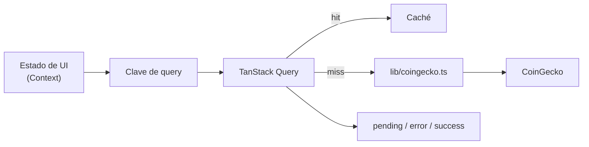
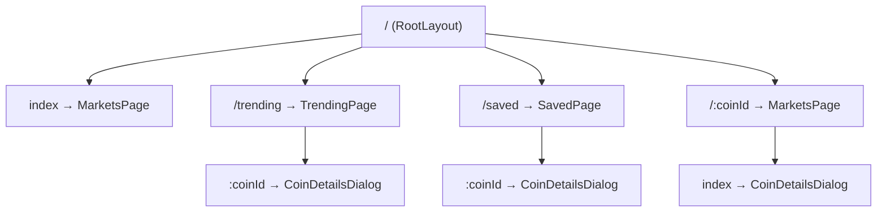

# ARCHITECTURE.md — Cryptosh1f

> Documento vivo. Describe la arquitectura tal y como está implementada tras la Fase 6.
>
> Restricción que domina todas las decisiones de esta arquitectura: **el límite de tasa de
> CoinGecko** (~10–30 req/min sin API key). Ver `PRODUCT.md` → R1.

---

# Arquitectura

## Capas

```
┌─────────────────────────────────────────────────┐
│ app/         Composición: router, providers, boundaries
├─────────────────────────────────────────────────┤
│ features/    markets · trending · saved · coin-details
│              cada una: componentes + hooks propios
├─────────────────────────────────────────────────┤
│ components/  UI compartida y sin estado
├─────────────────────────────────────────────────┤
│ lib/         coingecko.ts (cliente único) · query · storage
├─────────────────────────────────────────────────┤
│ types/       Contratos de la API validados con Zod
└─────────────────────────────────────────────────┘
```

### Por qué existe cada capa

- **`app/`** — separa _qué se compone_ de _qué hace cada cosa_. Hoy `main.jsx` mezcla rutas y
  `Home.jsx` mezcla layout con providers; al separarlo, añadir un provider deja de tocar el layout.
- **`features/`** — agrupa por dominio y no por tipo de archivo. Hoy entender "guardados" obliga a
  abrir `pages/Saved.jsx`, `context/StorageContext.jsx` y `components/TableComponent.jsx`.
  Feature-first hace que un cambio de dominio toque una sola carpeta.
- **`components/`** — solo lo que se usa en más de una feature. `SaveBtn`, hoy duplicado literalmente
  en dos archivos, vive aquí una vez.
- **`lib/coingecko.ts`** — un único punto donde existen la base URL, el timeout, la cancelación, el
  reintento y la normalización de errores. Hoy esas cinco decisiones están tomadas siete veces (o
  ninguna).
- **`types/`** — la respuesta de CoinGecko deja de ser opaca. `data.market_data.current_price[currency]`
  se vuelve verificable en tiempo de compilación en vez de en tiempo de ejecución.

## Capa de datos

TanStack Query reemplaza los tres providers de fetching. **Qué resuelve, punto por punto:**

| Problema actual           | Cómo se resuelve                                            |
| ------------------------- | ----------------------------------------------------------- |
| Un 429 = spinner infinito | `status: 'error'` es un estado real y distinto de `pending` |
| Sin caché → cuota agotada | Caché por clave; volver a una pestaña no repite la petición |
| Carrera entre respuestas  | Query descarta las respuestas obsoletas por clave           |
| Sin cancelación           | `AbortController` inyectado en cada `queryFn`               |
| Sin reintento             | Backoff exponencial, sin reintentar en 4xx                  |

Los contextos **no desaparecen**: `CryptoContext` sigue siendo el dueño del estado de UI
(divisa, orden, página) porque eso no es estado de servidor. Lo que se va es el fetching.



## Boundaries objetivo

| Boundary        | Implementación                                                                     |
| --------------- | ---------------------------------------------------------------------------------- |
| Error de render | `ErrorBoundary` en la raíz y por feature: un fallo en el gráfico no tumba la tabla |
| Error de red    | Estado de error por query, con acción de **reintentar** visible                    |
| Carga           | Skeletons con la forma del contenido real, no un spinner centrado                  |
| Vacío           | Estado propio, distinto de carga y de error                                        |

## Propiedad de carpetas

| Carpeta       | Regla                                                                        |
| ------------- | ---------------------------------------------------------------------------- |
| `app/`        | Solo composición. Sin lógica de dominio                                      |
| `features/*/` | Puede importar de `components/`, `lib/`, `types/`. **Nunca de otra feature** |
| `components/` | Sin estado de servidor, sin imports de features                              |
| `lib/`        | Sin React. Testeable en aislamiento                                          |
| `types/`      | Solo tipos y esquemas Zod                                                    |

La regla "nunca de otra feature" es la que evita que la estructura degenere: si dos features
necesitan lo mismo, ese algo sube a `components/` o `lib/`.

## Grafo de rutas



El modal aparece bajo las tres vistas de lista a propósito: es lo que permite abrirlo
conservando la lista de fondo. Ojo con un detalle que costó un fallo real: bajo el padre
`/:coinId` el hijo tiene que ser un **`index`**, no otro `:coinId`. Repetirlo genera la
ruta `/:coinId/:coinId`, que no empareja nunca y deja el modal sin montar.

## Jerarquía de providers

```
ErrorBoundary                 ← captura fallos de render de todo lo de abajo
  └─ QueryClientProvider      ← estado de servidor: caché, reintentos, cancelación
       └─ MarketsProvider     ← estado de UI: divisa, orden, página
            └─ WatchlistProvider  ← guardados; lee la divisa del anterior
                 └─ RouterProvider
```

`MarketsProvider` envuelve a `WatchlistProvider` porque la vista de guardados necesita la
divisa elegida en la de mercado. Es la misma dependencia que existía entre `StorageContext`
y `CryptoContext`, pero ahora está declarada donde se ve.

## Verificación

| Comando             | Qué comprueba                                                       |
| ------------------- | ------------------------------------------------------------------- |
| `pnpm typecheck`    | TypeScript strict sobre todo `src/`                                 |
| `pnpm lint`         | oxlint: corrección, accesibilidad, hooks, imports                   |
| `pnpm format:check` | oxfmt                                                               |
| `pnpm contrast`     | Cada token de color contra su umbral WCAG                           |
| `pnpm smoke`        | 18 comprobaciones end-to-end en Chromium con CoinGecko interceptado |
| `pnpm validate`     | Todo lo anterior más el build de producción                         |
